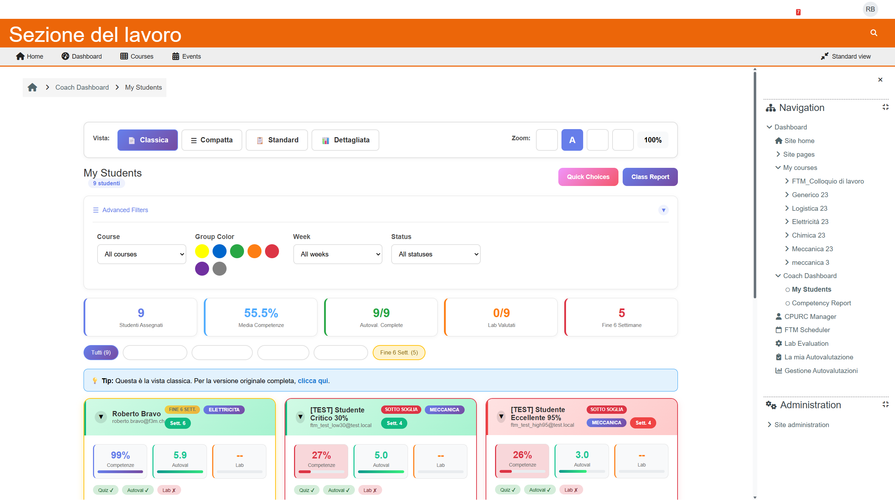
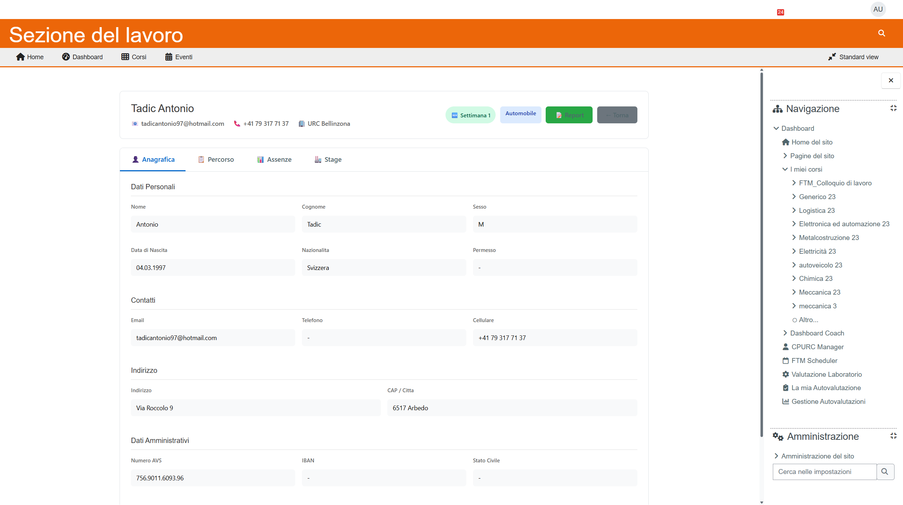
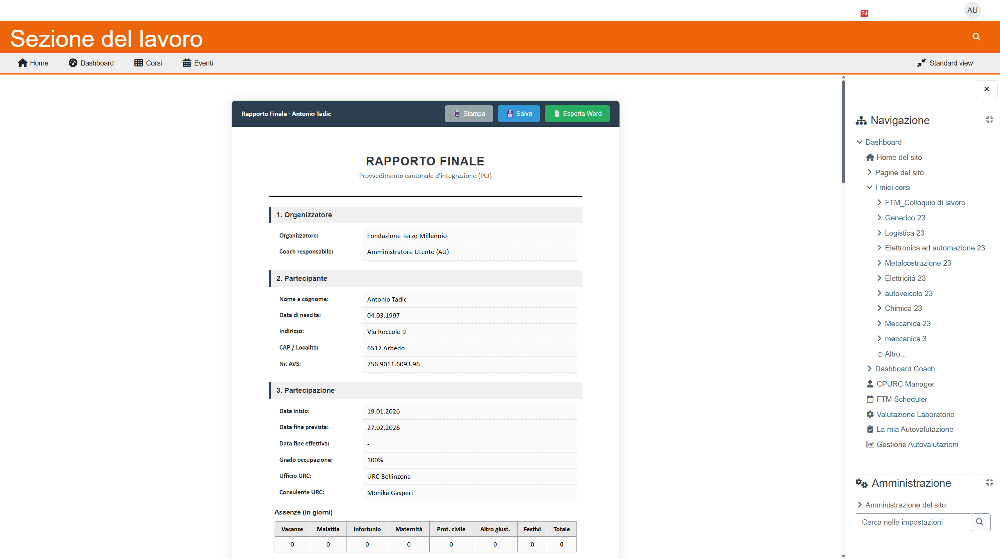

# FTM PLUGINS - Guida Rapida

**Versione:** 1.0 | **Data:** 24 Gennaio 2026

---

## Cos'è il Sistema FTM?

Il sistema FTM (Fondazione Terzo Millennio) è un insieme di strumenti integrati in Moodle per:

- **Gestire gli studenti** del programma CPURC
- **Tracciare le competenze** professionali
- **Generare report** in formato Word
- **Pianificare le attività** con il calendario

---

## Chi Usa Cosa?

| Ruolo | Strumenti Principali |
|-------|---------------------|
| **Coach** | Dashboard Coach, Report Competenze, Calendario |
| **Segreteria** | Dashboard CPURC, Import CSV, Export Massivo, Gestione Settori |

---

## Accesso Rapido

### Per i Coach

| Cosa Vuoi Fare? | Dove Andare |
|-----------------|-------------|
| Vedere i miei studenti | **Dashboard Coach** |
| Compilare un report | Dashboard → Studente → **Report** |
| Vedere il calendario | **FTM Scheduler** |
| Esportare report Word | Dashboard → Studente → **Export Word** |

### Per la Segreteria

| Cosa Vuoi Fare? | Dove Andare |
|-----------------|-------------|
| Vedere tutti gli studenti CPURC | **Dashboard CPURC** |
| Importare nuovi studenti | Dashboard CPURC → **Import CSV** |
| Assegnare coach agli studenti | Dashboard CPURC → Colonna **Coach** |
| Assegnare settori | Dashboard → Studente → Tab **Percorso** |
| Esportare tutti i report | Dashboard CPURC → **Export Word ZIP** |
| Esportare Excel | Dashboard CPURC → **Export Excel** |

---

## Le 5 Pagine Principali

### 1. Dashboard Coach

**URL:** `/local/coachmanager/coach_dashboard_v2.php`

Mostra tutti gli studenti assegnati al coach con:
- Filtri per corso, gruppo, settimana
- Timeline 6 settimane
- Pulsante zoom per accessibilità (A-, A, A+, A++)

---

### 2. Dashboard CPURC (Segreteria)

**URL:** `/local/ftm_cpurc/index.php`

Lista completa studenti CPURC con:
- Filtri: ricerca, URC, settore, stato report, coach
- Colonna coach editabile
- Export Excel e Word ZIP

---

### 3. Scheda Studente

**URL:** `/local/ftm_cpurc/student_card.php?id=X`

4 tab informativi:
- **Anagrafica:** dati personali, contatti
- **Percorso:** URC, coach, settori
- **Assenze:** riepilogo assenze
- **Stage:** dati azienda stage

---

### 4. Report Word

**URL:** `/local/ftm_cpurc/report.php?id=X`

Compilazione report finale con:
- Sezioni narrative (comportamento, competenze, raccomandazioni)
- Salvataggio automatico bozza
- Generazione documento Word

---

### 5. Calendario FTM

**URL:** `/local/ftm_scheduler/index.php`

Pianificazione attività con:
- Vista settimanale e mensile
- Gruppi colore (Giallo, Grigio, Rosso, Marrone, Viola)
- Gestione aule e atelier

---

## Icone e Simboli

| Icona | Significato |
|-------|-------------|
| 🆕 | Studente nuovo (settimana 1-2) |
| ⏳ | Studente in corso (settimana 3-4) |
| ⚠️ | Fine vicina (settimana 5-6) |
| 🔴 | Prolungamento (settimana 7+) |
| 📝 | Report da compilare |
| ✅ | Report completato |
| 📄 | Esporta Word |
| 📊 | Esporta Excel |

---

## Settori Disponibili

| Codice | Nome Completo | Colore Badge |
|--------|---------------|--------------|
| AUTOMOBILE | Automobile | Blu |
| MECCANICA | Meccanica | Verde |
| LOGISTICA | Logistica | Giallo |
| ELETTRICITA | Elettricità | Rosso |
| AUTOMAZIONE | Automazione | Viola |
| METALCOSTRUZIONE | Metalcostruzione | Grigio |
| CHIMFARM | Chimico-Farmaceutico | Rosa |

---

## Hai Bisogno di Aiuto?

- **Manuale Coach:** `docs/manuali/coach/`
- **Manuale Segreteria:** `docs/manuali/segreteria/`
- **Problemi comuni:** `docs/manuali/99_TROUBLESHOOTING.md`

**Contatto supporto:** [inserire email/telefono]

---

*Fondazione Terzo Millennio - Sistema FTM v5.0*
