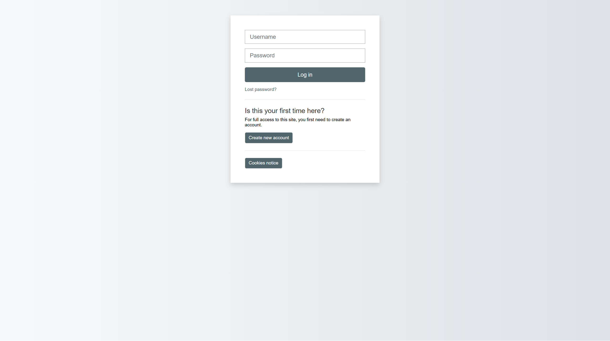
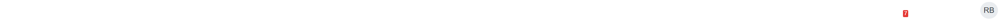
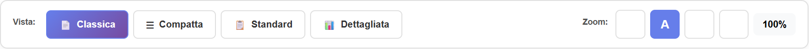
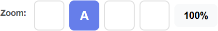
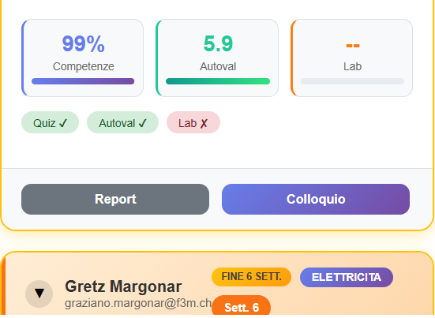
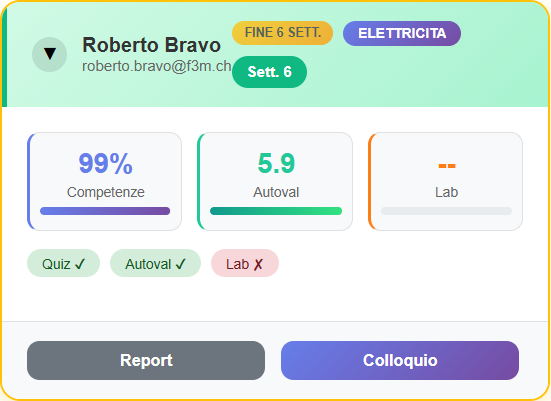

# Manuale Coach - Dashboard

**Versione:** 1.0 | **Data:** 24 Gennaio 2026

---

## Indice

1. [Accesso alla Dashboard](#1-accesso-alla-dashboard)
2. [Panoramica Interfaccia](#2-panoramica-interfaccia)
3. [Usare i Filtri](#3-usare-i-filtri)
4. [Cambiare Vista](#4-cambiare-vista)
5. [Usare lo Zoom](#5-usare-lo-zoom)
6. [Capire le Card Studente](#6-capire-le-card-studente)
7. [Azioni Rapide](#7-azioni-rapide)

---

## 1. Accesso alla Dashboard

### Passo 1: Accedi a Moodle
1. Apri il browser (Chrome, Firefox, Edge)
2. Vai all'indirizzo: `https://test-urc.hizuvala.myhostpoint.ch`
3. Inserisci le tue credenziali
4. Clicca **Accedi**



### Passo 2: Vai alla Dashboard Coach
1. Nel menu laterale, cerca **FTM Tools** oppure
2. Vai direttamente a: `/local/coachmanager/coach_dashboard_v2.php`



> **Suggerimento:** Salva la pagina nei preferiti per accesso rapido!

---

## 2. Panoramica Interfaccia

La Dashboard Coach è divisa in queste aree:

```
┌─────────────────────────────────────────────────────────┐
│  BARRA SUPERIORE                                        │
│  [Filtri] [Vista] [Zoom]                               │
├─────────────────────────────────────────────────────────┤
│                                                         │
│  ┌─────────────┐  ┌─────────────┐  ┌─────────────┐    │
│  │  STUDENTE 1 │  │  STUDENTE 2 │  │  STUDENTE 3 │    │
│  │  Card       │  │  Card       │  │  Card       │    │
│  └─────────────┘  └─────────────┘  └─────────────┘    │
│                                                         │
│  AREA CARD STUDENTI                                    │
│                                                         │
└─────────────────────────────────────────────────────────┘
```

### Elementi della Barra Superiore

| Elemento | Funzione |
|----------|----------|
| **Corso** | Filtra studenti per corso |
| **Gruppo** | Filtra per colore gruppo (Giallo, Grigio, etc.) |
| **Settimana** | Filtra per settimana corrente |
| **Stato** | Filtra per stato (attivo, concluso) |
| **Vista** | Cambia layout (Classica, Compatta, Standard, Dettagliata) |
| **Zoom** | Ingrandisci/riduci (A-, A, A+, A++) |



---

## 3. Usare i Filtri

### Filtro per Corso

1. Clicca sul menu a tendina **Corso**
2. Seleziona il corso desiderato
3. La lista si aggiorna automaticamente


### Filtro per Gruppo Colore

I gruppi colore identificano tipologie di studenti:

| Colore | Significato |
|--------|-------------|
| 🟡 Giallo | [Descrizione gruppo] |
| ⬜ Grigio | [Descrizione gruppo] |
| 🔴 Rosso | [Descrizione gruppo] |
| 🟤 Marrone | [Descrizione gruppo] |
| 🟣 Viola | [Descrizione gruppo] |

**Come filtrare:**
1. Clicca sul menu **Gruppo**
2. Seleziona il colore
3. Vedrai solo gli studenti di quel gruppo


### Filtro per Settimana

1. Clicca sul menu **Settimana**
2. Seleziona la settimana (1-6+)
3. Vedrai solo gli studenti in quella settimana del percorso

> **Nota:** La settimana viene calcolata dalla data di inizio del percorso

---

## 4. Cambiare Vista

La Dashboard offre 4 viste diverse per adattarsi alle tue preferenze:

### Vista Classica (Default)
- Tutte le informazioni visibili
- Consigliata per analisi dettagliata

### Vista Compatta
- Card più piccole
- Ideale quando hai molti studenti
- Mostra solo info essenziali

### Vista Standard
- Bilanciata tra dettaglio e spazio
- Consigliata per uso quotidiano

### Vista Dettagliata
- Massimo dettaglio
- Timeline espansa
- Per analisi approfondite

**Come cambiare vista:**

1. Trova i pulsanti vista nella barra superiore:
   ```
   [Classica] [Compatta] [Standard] [Dettagliata]
   ```
2. Clicca sulla vista desiderata
3. La dashboard si aggiorna immediatamente


> **Suggerimento:** La tua preferenza viene salvata automaticamente!

---

## 5. Usare lo Zoom

Lo zoom è pensato per migliorare la leggibilità, specialmente su schermi piccoli o per chi preferisce caratteri più grandi.

### Livelli di Zoom Disponibili

| Livello | Scala | Quando Usarlo |
|---------|-------|---------------|
| **A-** | 90% | Schermi piccoli, vedere più contenuto |
| **A** | 100% | Default, dimensione normale |
| **A+** | 120% | Leggibilità migliorata |
| **A++** | 140% | Caratteri molto grandi |

**Come cambiare zoom:**

1. Trova i pulsanti zoom nella barra superiore:
   ```
   [A-] [A] [A+] [A++]
   ```
2. Clicca sul livello desiderato
3. Tutta la pagina si ridimensiona



> **Suggerimento:** Anche lo zoom viene salvato nelle tue preferenze!

---

## 6. Capire le Card Studente

Ogni studente è rappresentato da una "card" (scheda) che mostra:

```
┌────────────────────────────────────────┐
│ 🟢 Mario Rossi                    [⋮]  │
│ ────────────────────────────────────── │
│ Settore: MECCANICA                     │
│ Settimana: 3 di 6                      │
│ Gruppo: 🟡 Giallo                      │
│ ────────────────────────────────────── │
│ Timeline:                              │
│ [S1✓] [S2✓] [S3●] [S4○] [S5○] [S6○]   │
│ ────────────────────────────────────── │
│ [📝 Note] [📄 Report] [📊 Competenze] │
└────────────────────────────────────────┘
```

### Elementi della Card

| Elemento | Significato |
|----------|-------------|
| **Pallino colorato** | Stato: 🟢 attivo, 🟡 in pausa, 🔴 concluso |
| **Nome** | Nome e cognome studente |
| **[⋮]** | Menu azioni rapide |
| **Settore** | Settore professionale assegnato |
| **Settimana** | Settimana corrente nel percorso |
| **Gruppo** | Colore del gruppo |
| **Timeline** | Progressione nelle 6 settimane |
| **Pulsanti** | Azioni disponibili |

### Capire la Timeline

La timeline mostra il progresso nelle 6 settimane:

| Simbolo | Significato |
|---------|-------------|
| ✓ | Settimana completata |
| ● | Settimana corrente |
| ○ | Settimana futura |
| ⚠ | Settimana con problemi |



---

## 7. Azioni Rapide

### Aprire la Scheda Studente
1. Clicca sul **nome dello studente**
2. Si apre la scheda completa

### Compilare il Report
1. Clicca sul pulsante **📝 Report** nella card
2. Oppure: Nome studente → Scheda → Tab Report

### Aggiungere Note
1. Clicca su **📝 Note** nella card
2. Scrivi la nota nel box
3. Clicca **Salva**

> **Importante:** Le note sono visibili anche alla segreteria!

### Esportare in Word
1. Clicca su **📄 Word** nella card
2. Il download parte automaticamente



---

## Problemi Comuni

### Non vedo nessuno studente
- Verifica i filtri attivi (potresti aver filtrato troppo)
- Clicca "Tutti" in ogni filtro per resettare

### La pagina è troppo piccola/grande
- Usa i pulsanti zoom (A-, A, A+, A++)
- La tua preferenza viene salvata

### Non trovo uno studente specifico
- Usa la ricerca (se disponibile)
- Controlla che sia nel corso corretto

---

## Prossimo Capitolo

➡️ [02_Gestione_Studenti.md](02_Gestione_Studenti.md) - Come gestire i singoli studenti

---

*Manuale Coach - FTM v5.0*
