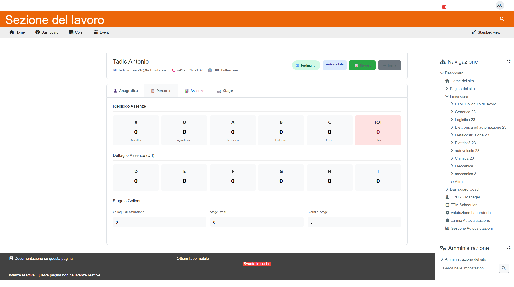
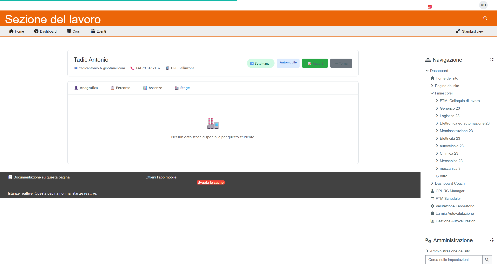

# Manuale Coach - Gestione Studenti

**Versione:** 1.0 | **Data:** 24 Gennaio 2026

---

## Indice

1. [Aprire la Scheda Studente](#1-aprire-la-scheda-studente)
2. [Navigare tra i Tab](#2-navigare-tra-i-tab)
3. [Tab Anagrafica](#3-tab-anagrafica)
4. [Tab Percorso](#4-tab-percorso)
5. [Tab Assenze](#5-tab-assenze)
6. [Tab Stage](#6-tab-stage)
7. [Aggiungere Note](#7-aggiungere-note)

---

## 1. Aprire la Scheda Studente

### Dalla Dashboard Coach

1. Trova lo studente nella lista
2. Clicca sul **nome dello studente**
3. Si apre la Scheda Studente


### Dall'URL Diretto

Se conosci l'ID dello studente:
```
/local/ftm_cpurc/student_card.php?id=123
```

---

## 2. Navigare tra i Tab

La scheda studente ha **4 tab** (schede):

```
┌──────────────────────────────────────────────────────┐
│  [👤 Anagrafica] [📋 Percorso] [📊 Assenze] [🏭 Stage] │
├──────────────────────────────────────────────────────┤
│                                                      │
│             CONTENUTO DEL TAB SELEZIONATO            │
│                                                      │
└──────────────────────────────────────────────────────┘
```

**Come navigare:**
1. Clicca sul nome del tab
2. Il contenuto si aggiorna
3. L'URL cambia (puoi salvare nei preferiti)


---

## 3. Tab Anagrafica

Il tab **Anagrafica** mostra i dati personali dello studente.

### Sezioni Disponibili

#### Dati Personali
| Campo | Esempio |
|-------|---------|
| Nome | Mario |
| Cognome | Rossi |
| Genere | M |
| Data di nascita | 15/03/1985 |
| Nazionalità | Italiana |
| Permesso | - |

#### Contatti
| Campo | Esempio |
|-------|---------|
| Email | mario.rossi@email.com |
| Telefono | 091 123 4567 |
| Cellulare | 079 123 4567 |

#### Indirizzo
| Campo | Esempio |
|-------|---------|
| Via | Via Roma 15 |
| CAP | 6900 |
| Città | Lugano |

#### Dati Amministrativi
| Campo | Esempio |
|-------|---------|
| Numero AVS | 756.1234.5678.90 |
| IBAN | CH12 3456 7890 1234 5678 9 |
| Stato civile | Celibe |


> **Nota:** Questi dati sono in sola lettura. Per modificarli, contatta la segreteria.

---

## 4. Tab Percorso

Il tab **Percorso** mostra le informazioni sul programma FTM.

### Sezioni Disponibili

#### Dati URC
| Campo | Descrizione |
|-------|-------------|
| Numero Personale | ID nel sistema URC |
| Ufficio URC | Ufficio di riferimento |
| Consulente URC | Nome del consulente |

#### Percorso FTM
| Campo | Descrizione |
|-------|-------------|
| Misura | Tipo di misura attiva |
| Data Inizio | Quando ha iniziato |
| Data Fine Prevista | Quando dovrebbe finire |
| Data Fine Effettiva | Se già concluso |
| Stato | Aperto/Chiuso |
| Grado Occupazione | Percentuale (es. 100%) |

#### Coach FTM Assegnato
Mostra il coach attualmente assegnato allo studente.


> **Importante:** Se non sei tu il coach assegnato, potresti non vedere alcune informazioni.

#### Professione e Settore
| Campo | Descrizione |
|-------|-------------|
| Ultima Professione | Lavoro precedente |
| Settore Rilevato | Settore assegnato (da professione o manuale) |

#### Assegnazione Settori (Multi-Settore)

Gli studenti possono avere fino a 3 settori:

| Livello | Funzione |
|---------|----------|
| 🥇 **Primario** | Determina quiz e autovalutazione |
| 🥈 **Secondario** | Suggerimento per il coach |
| 🥉 **Terziario** | Suggerimento aggiuntivo |


> **Nota:** Solo la segreteria può modificare i settori.

---

## 5. Tab Assenze

Il tab **Assenze** mostra il riepilogo delle assenze.

### Codici Assenze

| Codice | Significato | Colore |
|--------|-------------|--------|
| **X** | Malattia | Grigio |
| **O** | Ingiustificata | Rosso |
| **A** | Permesso | Giallo |
| **B** | Colloquio | Blu |
| **C** | Corso | Verde |
| **D-I** | Altri codici | Grigio |
| **TOT** | Totale | Rosso intenso |

### Visualizzazione

```
┌─────┬─────┬─────┬─────┬─────┬─────┐
│  X  │  O  │  A  │  B  │  C  │ TOT │
│  3  │  1  │  2  │  4  │  0  │ 10  │
│Malat│Ingiu│Perm.│Coll.│Corso│Total│
└─────┴─────┴─────┴─────┴─────┴─────┘
```



### Interpretazione

- **Assenze Totali < 5:** Buona frequenza ✅
- **Assenze Totali 5-10:** Monitorare ⚠️
- **Assenze Totali > 10:** Attenzione! 🔴

---

## 6. Tab Stage

Il tab **Stage** mostra le informazioni sullo stage aziendale.

### Se lo Studente ha uno Stage

#### Dati Stage
| Campo | Esempio |
|-------|---------|
| Data Inizio | 01/02/2026 |
| Data Fine | 28/02/2026 |
| Percentuale | 100% |

#### Azienda
| Campo | Esempio |
|-------|---------|
| Nome Azienda | ABC Meccanica SA |
| Indirizzo | Via Industria 10 |
| CAP/Città | 6900 Lugano |
| Funzione | Meccanico auto |

#### Contatto Aziendale
| Campo | Esempio |
|-------|---------|
| Nome | Paolo Verdi |
| Telefono | 091 987 6543 |
| Email | p.verdi@abcmeccanica.ch |



### Se lo Studente NON ha uno Stage

Vedrai un messaggio:
```
🏭 Nessun dato stage disponibile per questo studente.
```

---

## 7. Aggiungere Note

Le note permettono di annotare osservazioni sullo studente.

### Come Aggiungere una Nota

1. **Dalla Card (Dashboard):**
   - Clicca sul pulsante **📝 Note**
   - Si apre un popup

2. **Dalla Scheda Studente:**
   - Cerca la sezione **Note Coach**
   - Clicca su **Aggiungi Nota**

### Scrivere la Nota

1. Inserisci il testo nel box
2. Clicca **Salva**
3. La nota viene salvata con data e ora


### Chi Vede le Note?

| Chi | Può Vedere | Può Modificare |
|-----|-----------|----------------|
| Tu (Coach autore) | ✅ Sì | ✅ Sì |
| Altri Coach | ❌ No | ❌ No |
| Segreteria | ✅ Sì | ❌ No |

> **Importante:** Le note sono visibili alla segreteria! Non scrivere informazioni sensibili inappropriate.

### Modificare o Eliminare una Nota

1. Trova la nota nella lista
2. Clicca sull'icona **✏️ Modifica** o **🗑️ Elimina**
3. Conferma l'azione

---

## Riepilogo Azioni

| Azione | Come Fare |
|--------|-----------|
| Vedere dati studente | Click su nome → Tab appropriato |
| Vedere assenze | Tab **Assenze** |
| Vedere stage | Tab **Stage** |
| Aggiungere nota | Pulsante **Note** o sezione Note |
| Tornare alla Dashboard | Pulsante **← Torna** |

---

## Prossimo Capitolo

➡️ [03_Report_Competenze.md](03_Report_Competenze.md) - Come compilare i report

---

*Manuale Coach - FTM v5.0*
