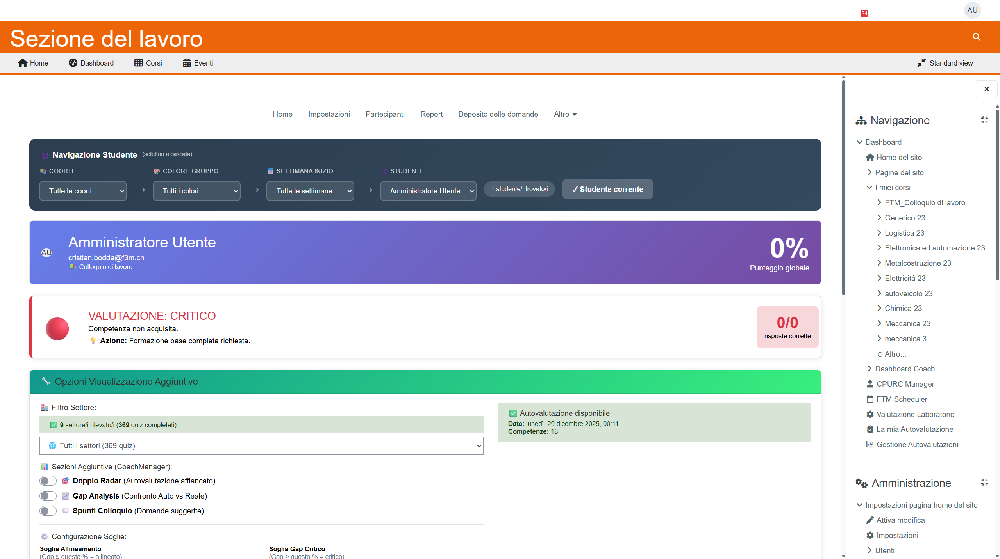

# Manuale Coach - Report e Competenze

**Versione:** 1.0 | **Data:** 24 Gennaio 2026

---

## Indice

1. [Cos'è il Report](#1-cosè-il-report)
2. [Accedere al Report](#2-accedere-al-report)
3. [Struttura del Report](#3-struttura-del-report)
4. [Compilare il Report](#4-compilare-il-report)
5. [Salvare la Bozza](#5-salvare-la-bozza)
6. [Finalizzare il Report](#6-finalizzare-il-report)
7. [Esportare in Word](#7-esportare-in-word)
8. [Report Competenze](#8-report-competenze)

---

## 1. Cos'è il Report

Il **Report** è il documento finale che descrive il percorso dello studente presso FTM. Include:

- Valutazione del comportamento
- Competenze tecniche acquisite
- Competenze trasversali
- Raccomandazioni del coach
- Conclusione e prospettive

Questo report viene poi:
- Stampato e consegnato allo studente
- Inviato all'URC
- Archiviato nel sistema

---

## 2. Accedere al Report

### Metodo 1: Dalla Dashboard Coach

1. Trova lo studente nella lista
2. Clicca sul pulsante **📝 Report** nella card


### Metodo 2: Dalla Scheda Studente

1. Apri la scheda studente
2. Clicca sul pulsante **📝 Report** in alto a destra

### Metodo 3: URL Diretto

```
/local/ftm_cpurc/report.php?id=123
```
(dove 123 è l'ID dello studente)

---

## 3. Struttura del Report

Il report è organizzato come un **documento** con sezioni:

```
┌─────────────────────────────────────────────────┐
│              INTESTAZIONE                        │
│  Nome Studente | Settore | Data                 │
├─────────────────────────────────────────────────┤
│                                                 │
│  1. DATI STUDENTE                               │
│     Info anagrafiche e percorso                 │
│                                                 │
├─────────────────────────────────────────────────┤
│                                                 │
│  2. VALUTAZIONE COMPORTAMENTALE                 │
│     [Area di testo editabile]                   │
│                                                 │
├─────────────────────────────────────────────────┤
│                                                 │
│  3. COMPETENZE TECNICHE                         │
│     [Area di testo editabile]                   │
│                                                 │
├─────────────────────────────────────────────────┤
│                                                 │
│  4. COMPETENZE TRASVERSALI                      │
│     [Area di testo editabile]                   │
│                                                 │
├─────────────────────────────────────────────────┤
│                                                 │
│  5. RACCOMANDAZIONI                             │
│     [Area di testo editabile]                   │
│                                                 │
├─────────────────────────────────────────────────┤
│                                                 │
│  6. CONCLUSIONE                                 │
│     [Area di testo editabile]                   │
│                                                 │
├─────────────────────────────────────────────────┤
│                                                 │
│  [💾 Salva Bozza]  [✅ Finalizza]  [📄 Word]   │
│                                                 │
└─────────────────────────────────────────────────┘
```

---

## 4. Compilare il Report

### Sezione: Valutazione Comportamentale

Descrivi il comportamento dello studente durante il percorso:

**Cosa includere:**
- Puntualità
- Rispetto delle regole
- Attitudine al lavoro
- Relazioni con colleghi e coach
- Evoluzione durante il percorso

**Esempio:**
```
Mario ha dimostrato fin dall'inizio un atteggiamento positivo
e proattivo. La puntualità è stata costante, così come il
rispetto delle regole del centro. Ha sviluppato ottime capacità
relazionali con i colleghi e ha mostrato apertura ai feedback
ricevuti dai coach.
```


### Sezione: Competenze Tecniche

Descrivi le competenze professionali acquisite:

**Cosa includere:**
- Competenze specifiche del settore
- Strumenti/macchinari utilizzati
- Livello raggiunto
- Aree di forza

**Esempio:**
```
Lo studente ha acquisito competenze nella manutenzione ordinaria
dei veicoli, incluso:
- Cambio olio e filtri
- Controllo sistema frenante
- Diagnostica base con strumenti elettronici
- Sostituzione pneumatici

Il livello raggiunto è buono, con particolare attitudine alla
diagnostica elettronica.
```

### Sezione: Competenze Trasversali

Descrivi le soft skills sviluppate:

**Cosa includere:**
- Comunicazione
- Problem solving
- Lavoro di squadra
- Gestione del tempo
- Adattabilità

**Esempio:**
```
Mario ha sviluppato buone competenze comunicative, sia con i
clienti che con i colleghi. Dimostra capacità di problem solving
quando affronta guasti imprevisti. Sa organizzare il proprio
lavoro e rispettare le tempistiche.
```

### Sezione: Raccomandazioni

Fornisci suggerimenti per il futuro:

**Cosa includere:**
- Percorsi formativi consigliati
- Aree da migliorare
- Tipologia di aziende adatte
- Consigli pratici

**Esempio:**
```
Si consiglia a Mario di:
- Approfondire la formazione sulla diagnostica elettronica
- Valutare un corso di specializzazione in veicoli ibridi/elettrici
- Cercare opportunità in officine certificate

Potrebbe beneficiare di un ulteriore periodo di pratica prima
dell'inserimento definitivo nel mondo del lavoro.
```

### Sezione: Conclusione

Riassumi il percorso e le prospettive:

**Esempio:**
```
Il percorso di Mario presso FTM si è concluso positivamente.
Ha raggiunto gli obiettivi prefissati e ha dimostrato interesse
e impegno costanti. È pronto per un inserimento nel mercato del
lavoro nel settore automobilistico, preferibilmente con un
periodo iniziale di affiancamento.
```

---

## 5. Salvare la Bozza

Puoi salvare il report come **bozza** in qualsiasi momento.

### Come Salvare

1. Compila le sezioni desiderate
2. Clicca **💾 Salva Bozza**
3. Appare il messaggio "Bozza salvata"


### Cosa Succede

- Il report viene salvato con stato "Bozza"
- Puoi tornare a modificarlo quando vuoi
- La segreteria vede che c'è una bozza in corso
- Non viene generato il documento Word finale

> **Suggerimento:** Salva spesso! Il sistema NON salva automaticamente.

### Riprendere una Bozza

1. Torna alla pagina del report
2. I dati salvati vengono caricati automaticamente
3. Continua la compilazione

---

## 6. Finalizzare il Report

Quando il report è completo, puoi **finalizzarlo**.

### Prima di Finalizzare

Verifica che:
- [ ] Tutte le sezioni sono compilate
- [ ] Il testo è stato riletto
- [ ] Non ci sono errori di battitura
- [ ] Le informazioni sono corrette

### Come Finalizzare

1. Clicca **✅ Finalizza Report**
2. Appare un messaggio di conferma:
   ```
   ⚠️ Attenzione: Una volta finalizzato, il report non potrà
   più essere modificato. Continuare?

   [Annulla] [Conferma]
   ```
3. Clicca **Conferma**


### Dopo la Finalizzazione

- Lo stato cambia da "Bozza" a "Completato"
- Il report non è più modificabile
- Puoi generare il documento Word
- La segreteria riceve notifica

> **Importante:** Una volta finalizzato, NON puoi più modificare il report! Contatta la segreteria se servono correzioni.

---

## 7. Esportare in Word

Genera il documento Word professionale da stampare o inviare.

### Come Esportare

1. Clicca **📄 Esporta Word**
2. Il download parte automaticamente
3. Apri il file con Microsoft Word o LibreOffice


### Contenuto del Documento Word

Il documento Word include:
- Intestazione con logo FTM
- Dati anagrafici studente
- Tutte le sezioni compilate
- Data e firma coach
- Footer professionale

### Requisiti

- Microsoft Word 2016+ oppure
- LibreOffice Writer 6+ oppure
- Google Docs (con conversione)

---

## 8. Report Competenze

Oltre al report narrativo, esiste il **Report Competenze** che mostra:

### Accesso

1. Dashboard Coach → Studente → **📊 Competenze**
2. Oppure: `/local/competencymanager/student_report.php?userid=X&courseid=Y`

### Contenuto

- **Grafico Radar:** Visualizzazione delle competenze
- **Lista Competenze:** Dettaglio per area
- **Autovalutazione vs Valutazione:** Confronto



### Stampa Report Competenze

1. Clicca **🖨️ Stampa**
2. Si apre la versione stampabile
3. Usa Ctrl+P (o Cmd+P su Mac)
4. Stampa o salva come PDF

---

## Riepilogo Flusso di Lavoro

```
1. Apri il Report
       ↓
2. Compila le sezioni
       ↓
3. Salva Bozza (ripeti più volte)
       ↓
4. Rileggi e verifica
       ↓
5. Finalizza Report
       ↓
6. Esporta in Word
       ↓
7. Stampa/Invia
```

---

## Problemi Comuni

### Non riesco a modificare il report
- Verifica che non sia già finalizzato
- Controlla di avere i permessi (sei il coach assegnato?)

### Il pulsante Word non funziona
- Verifica che il report sia finalizzato
- Prova con un altro browser
- Contatta il supporto tecnico

### Ho finalizzato per errore
- Contatta la segreteria
- Spiega cosa va modificato
- Solo gli admin possono sbloccare un report

---

## Prossimo Capitolo

➡️ [04_Calendario.md](04_Calendario.md) - Come usare il calendario FTM

---

*Manuale Coach - FTM v5.0*
