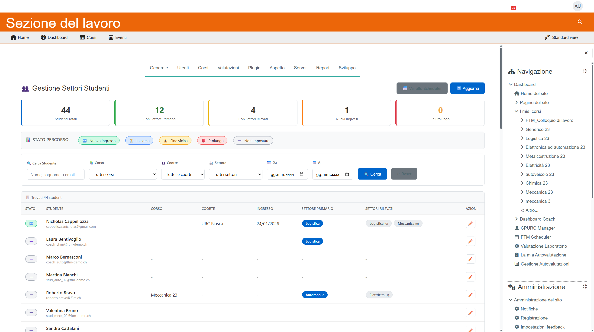

# Manuale Segreteria - Gestione Settori e Coach

**Versione:** 1.0 | **Data:** 24 Gennaio 2026

---

## Indice

1. [Il Sistema Multi-Settore](#1-il-sistema-multi-settore)
2. [Assegnare i Settori](#2-assegnare-i-settori)
3. [Eliminare un Settore](#3-eliminare-un-settore)
4. [Settori Rilevati Automaticamente](#4-settori-rilevati-automaticamente)
5. [Assegnare il Coach](#5-assegnare-il-coach)
6. [Gestione Settori Avanzata](#6-gestione-settori-avanzata)

---

## 1. Il Sistema Multi-Settore

Ogni studente può avere **fino a 3 settori**:

### I Tre Livelli

| Livello | Icona | Funzione |
|---------|-------|----------|
| **Primario** | 🥇 | Determina quiz e autovalutazione assegnati |
| **Secondario** | 🥈 | Suggerimento per il coach |
| **Terziario** | 🥉 | Suggerimento aggiuntivo |

### Importanza del Settore Primario

Il settore **primario** è cruciale perché:

1. **Quiz automatici:** Lo studente riceve solo quiz del suo settore
2. **Autovalutazione:** Le competenze assegnate sono del settore primario
3. **Report:** Il settore appare nel report finale

> **Importante:** Senza settore primario, lo studente potrebbe non ricevere i materiali corretti!

### Settori Disponibili

| Codice | Nome Completo |
|--------|---------------|
| AUTOMOBILE | Automobile / Autoveicoli |
| MECCANICA | Meccanica |
| LOGISTICA | Logistica |
| ELETTRICITA | Elettricità |
| AUTOMAZIONE | Automazione |
| METALCOSTRUZIONE | Metalcostruzione |
| CHIMFARM | Chimico-Farmaceutico |

---

## 2. Assegnare i Settori

### Dove Assegnare

1. Dashboard CPURC → Click su studente → Tab **Percorso**
2. Oppure: `/local/ftm_cpurc/student_card.php?id=X&tab=percorso`

### Sezione Assegnazione Settori

```
┌─────────────────────────────────────────────────────────┐
│  🎯 Assegnazione Settori                                │
├─────────────────────────────────────────────────────────┤
│                                                         │
│  Primario: Assegna quiz e autovalutazione              │
│  Secondario/Terziario: Suggerimenti per il coach       │
│                                                         │
│  ┌────────────────┐ ┌────────────────┐ ┌────────────────┐
│  │🥇 Primario  ❌ │ │🥈 Secondario ❌│ │🥉 Terziario ❌│
│  │[MECCANICA   ▼]│ │[AUTOMOBILE  ▼]│ │[-- Nessuno ▼]│
│  └────────────────┘ └────────────────┘ └────────────────┘
│                                                         │
│  [💾 Salva Settori]                                     │
│                                                         │
└─────────────────────────────────────────────────────────┘
```

### Procedura

1. **Apri la scheda** dello studente
2. Vai al tab **Percorso**
3. Trova la sezione **🎯 Assegnazione Settori**
4. **Seleziona i settori** dai menu a tendina:
   - 🥇 Primario: **Obbligatorio** - scegli il settore principale
   - 🥈 Secondario: Opzionale - se ha interesse in un secondo settore
   - 🥉 Terziario: Opzionale - se ha interesse in un terzo settore
5. Clicca **💾 Salva Settori**
6. Attendi il messaggio "✅ Settori salvati"


### Regole

- I tre settori devono essere **diversi** tra loro
- Non puoi assegnare lo stesso settore a più livelli
- Il primario è l'unico obbligatorio

---

## 3. Eliminare un Settore

### Eliminare dalla Tendina

Per rimuovere un settore assegnato:

1. Clicca sulla **❌** accanto al nome del settore
2. Il menu torna a "-- Seleziona --"
3. Clicca **💾 Salva Settori**


### Eliminare dai Settori Rilevati

Se il settore è stato rilevato automaticamente:

1. Trova la sezione **"Settori rilevati automaticamente (da quiz)"**
2. Clicca sulla **❌** sul badge del settore
3. Conferma l'eliminazione
4. Il settore viene rimosso

```
┌─────────────────────────────────────────────────────────┐
│  Settori rilevati automaticamente (da quiz):            │
│                                                         │
│  [MECCANICA 🥇 (3 quiz) ❌] [AUTOMOBILE (1 quiz) ❌]    │
│                                                         │
└─────────────────────────────────────────────────────────┘
```


> **Nota:** Eliminando un settore rilevato, vengono eliminati anche i riferimenti dai quiz completati.

---

## 4. Settori Rilevati Automaticamente

Il sistema rileva automaticamente i settori quando lo studente:

1. **Completa un quiz** del settore
2. **Fa l'autovalutazione** di competenze del settore

### Come Funziona

```
Studente completa quiz MECCANICA
         ↓
Sistema rileva competenze MECCANICA
         ↓
Settore MECCANICA aggiunto a "rilevati"
         ↓
Se nessun primario → diventa primario
```

### Visualizzazione

I settori rilevati appaiono sotto l'assegnazione:

```
Settori rilevati automaticamente (da quiz):
[MECCANICA 🥇 (3 quiz)] [AUTOMOBILE (1 quiz)]
```

Ogni badge mostra:
- Nome del settore
- 🥇 se è il primario
- Numero di quiz completati in quel settore

### Cosa Fare

1. **Verifica** che il settore rilevato sia corretto
2. **Conferma** assegnandolo come primario se appropriato
3. **Correggi** se il rilevamento automatico è errato

---

## 5. Assegnare il Coach

### Dalla Dashboard (Metodo Rapido)

1. Trova lo studente nella lista
2. Clicca sul **dropdown Coach** nella sua riga
3. Seleziona il coach
4. Il salvataggio è automatico


### Dalla Scheda Studente

1. Apri la scheda studente
2. Vai al tab **Percorso**
3. Trova la sezione **👨‍🏫 Coach FTM Assegnato**
4. Seleziona il coach dal dropdown
5. Clicca **💾 Salva Coach**

```
┌─────────────────────────────────────────────────────────┐
│  👨‍🏫 Coach FTM Assegnato                                │
├─────────────────────────────────────────────────────────┤
│                                                         │
│  Coach Attuale:                                         │
│  [Cristian Bodda (CB)] (cristian.bodda@ftm.ch)         │
│                                                         │
│  Cambia Coach: [CB - Cristian Bodda ▼] ❌              │
│                                                         │
│  [💾 Salva Coach]                                       │
│                                                         │
└─────────────────────────────────────────────────────────┘
```


### Coach Disponibili

| Sigla | Nome Completo |
|-------|---------------|
| CB | Cristian Bodda |
| FM | Fabio Marinoni |
| GM | Graziano Margonar |
| RB | Roberto Bravo |

### Rimuovere il Coach

1. Clicca sulla **❌** accanto al dropdown
2. Il campo torna a "-- Seleziona --"
3. Clicca **💾 Salva Coach**

### Sincronizzazione

L'assegnazione coach è **sincronizzata** con tutti i plugin FTM:
- Dashboard Coach
- Coachmanager
- Report

---

## 6. Gestione Settori Avanzata

### Sector Admin (Amministrazione Settori)

Per gestione avanzata dei settori di sistema:

**URL:** `/local/competencymanager/sector_admin.php`

**Funzioni:**
- Visualizzare tutti gli studenti per settore
- Assegnazioni massive
- Report statistici per settore



### Verifica Coerenza

Controlla periodicamente:

1. **Studenti senza settore primario:**
   - Dashboard → Filtro Settore → Tutti → Cerca vuoti
   - Assegna il settore mancante

2. **Settori errati:**
   - Verifica che il settore corrisponda alla professione
   - Correggi se necessario

3. **Coach non assegnati:**
   - Dashboard → Filtro Coach → Nessuno
   - Assegna i coach mancanti

### Best Practice

| Situazione | Azione Consigliata |
|------------|---------------------|
| Nuovo studente | Assegna subito settore primario e coach |
| Cambio interessi | Aggiorna settore secondario/terziario |
| Errore settore | Elimina e riassegna |
| Coach in ferie | Riassegna temporaneamente |

---

## Riepilogo Operazioni

| Operazione | Dove | Come |
|------------|------|------|
| Assegnare settore primario | Scheda → Percorso | Dropdown + Salva |
| Assegnare settore secondario | Scheda → Percorso | Dropdown + Salva |
| Eliminare settore | Scheda → Percorso | ❌ + Salva |
| Eliminare settore rilevato | Scheda → Percorso | ❌ sul badge |
| Assegnare coach (rapido) | Dashboard | Dropdown nella riga |
| Assegnare coach (completo) | Scheda → Percorso | Dropdown + Salva |

---

## Prossimo Capitolo

➡️ [04_Troubleshooting.md](../99_TROUBLESHOOTING.md) - Problemi comuni e soluzioni

---

*Manuale Segreteria - FTM v5.0*
